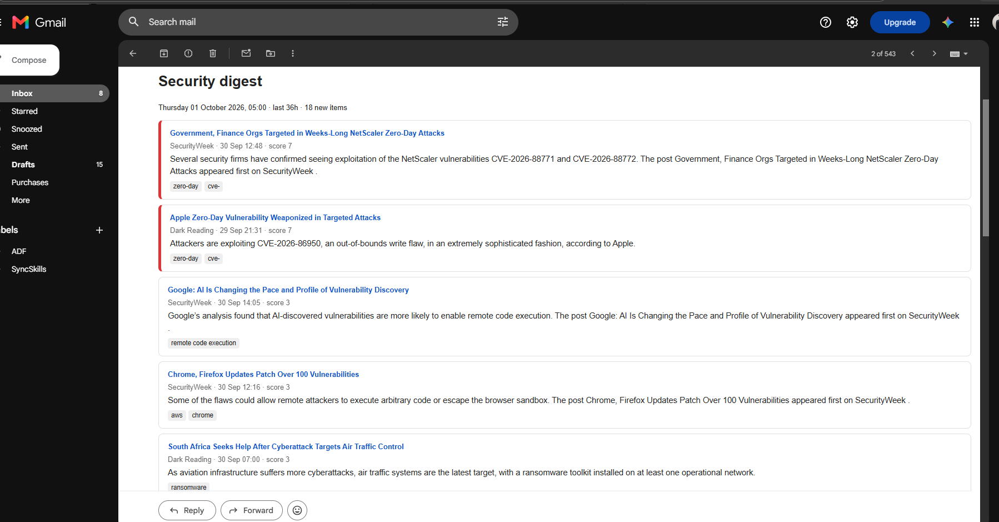
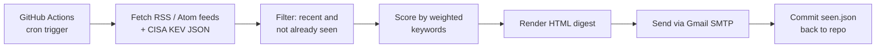

# Security-News-Digest-Pipeline

A small, dependency-free pipeline that collects cybersecurity news and newly exploited vulnerabilities each morning, ranks them by relevance, and emails me a single HTML digest. It runs entirely on GitHub Actions, so nothing needs to stay powered on.

## What it does

- Pulls items from several security news RSS/Atom feeds and from CISA's **Known Exploited Vulnerabilities (KEV)** catalog
- Drops anything older than the lookback window (default 36 hours) or already seen in a previous run
- Scores each item against a weighted keyword list (e.g. `zero-day`, `ESXi`, `Active Directory`, `ransomware`) so the most relevant items float to the top
- Sends the top items as one styled HTML email, with a footer listing any sources that failed
- Runs daily on a cron schedule, in well under a minute

## Architecture

| File | Purpose |
|---|---|
| `sec_news_digest.py` | Fetching, parsing, scoring, rendering and email delivery (Python standard library only) |
| `.github/workflows/ddigest.yml` | Scheduled and manual workflow that runs the script and persists state |

## Design decisions

**Secrets stay out of the code.** Gmail credentials are read from environment variables populated by GitHub Actions Secrets (`GMAIL_USER`, `GMAIL_APP_PASSWORD`, `DIGEST_TO`). I use a dedicated sending account with an app password, so the credential can be revoked instantly without touching my main account.

**Least privilege.** The workflow requests only `contents: write`, which it needs to commit `seen.json`, and nothing else.

**State survives ephemeral runners.** An Actions runner is a fresh machine every run, so the list of already-seen links is committed back to the repo after each digest. Without this, every email would repeat the previous one.

**Failures don't lose data.** Items are marked as seen only after the email is sent successfully. If delivery fails, the run exits non-zero (visible in the Actions tab and in GitHub's failure notifications) and the same items are retried next time.

**Sources fail independently.** One broken feed produces a warning in the email footer instead of killing the run.

**No third-party dependencies.** The script uses only the standard library, which keeps the supply-chain surface of the pipeline itself at zero and avoids dependency-update maintenance.

**Concurrency control.** A concurrency group prevents two runs from overlapping and clashing on `seen.json`.

## Problems I ran into

- **CISA's advisory RSS feed returned HTTP 403 to automated clients.** The same URL loads in a browser. Rather than spoof a browser, I relied on the CISA KEV catalog, which still worked, and added other feeds.
- **A vendor feed was not well-formed XML** (bare ampersands and stray control characters), which made Python's strict parser reject the entire feed. I added a fallback that sanitises the text and retries, so valid feeds take the normal path and malformed ones still get read.
- **Node.js 20 deprecation warnings** on the GitHub-provided actions. Resolved by moving to the current major versions of `actions/checkout` and `actions/setup-python`.
- **Scheduled workflows run in UTC and can start late.** The cron is set for 07:30 in Brisbane (UTC+10, no daylight saving), and the digest does not depend on exact timing.

## Running it yourself

1. Use **private** repository, also [see short note](docs/short-project-set-up-note.txt)
2. Create a Gmail app password (requires 2-Step Verification) for a sending account.
3. In the repo, go to **Settings → Secrets and variables → Actions** and add:
   - `GMAIL_USER`: the sending address
   - `GMAIL_APP_PASSWORD`: the app password
   - `DIGEST_TO`: where to receive the digest
4. Adjust the `FEEDS` and `KEYWORDS` blocks at the top of `sec_digest.py`.
5. Run the workflow manually from the **Actions** tab to test, then let the schedule take over.

To try it locally without email: [python sec_news_digest.py](docs/sec_news_digest.py). This writes an HTML file to [ddigests/](docs/ddigests.yml) and opens it in your browser.

> The scheduled trigger in this public copy is intentionally disabled. The live pipeline runs from a private repository, since it depends on my credentials.

## Limitations and ideas

- Keyword scoring is simple. It works well for my focus areas but is not semantic.
- Feed URLs change occasionally and need occasional maintenance. Failed sources are reported in each email.
- Possible next steps: LLM-generated summaries of the top items, alerting when a keyword matching my own technology stack appears, and per-source weighting.
